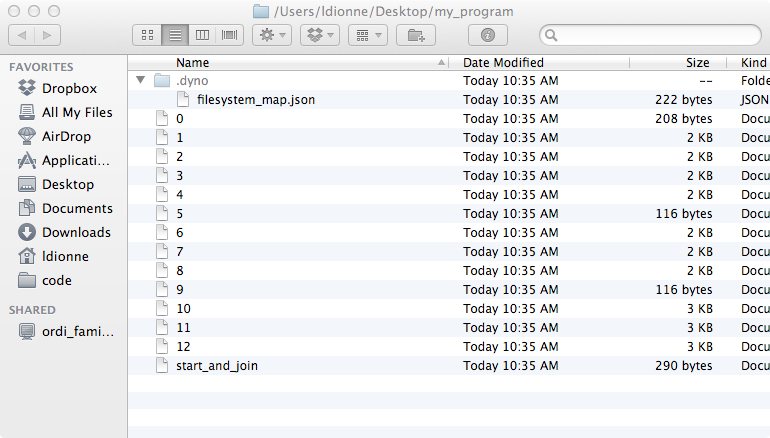

<!SLIDE subsection>
# Design and usage

<!SLIDE bullets incremental>
## `d2` needs to record 4 types of events

* Lock acquire and release
* Thread start and join

<!SLIDE>
## High level API with concepts from Boost.Thread

    @@@ cpp
        boost::BasicLockable
        boost::Lockable
        boost::TimedLockable

<!SLIDE>
## Simply wrap your class with the corresponding wrapper

    @@@ cpp
        class untracked_mutex {
        public:
          void lock();
          void unlock();
        };

        typedef d2::basic_lockable<untracked_mutex> mutex;

<!SLIDE skip>
.notes explain why this exists (nested typedef representing the mutex type)

## You can also use a mixin to achieve the same effect

    @@@ cpp
        class mutex : d2::basic_lockable_mixin<mutex> {
          friend class d2::access;
          void lock_impl();
          void unlock_impl();
        };

<!SLIDE>
## All wrappers have a recursive counterpart

    @@@ cpp
        d2::recursive_basic_lockable
        d2::recursive_lockable
        d2::recursive_timed_lockable

<!SLIDE>
## You can also bypass the concept based API

    @@@ cpp
        class mutex : d2::trackable_sync_object<d2::non_recursive> {
        public:
          void some_method_to_lock() {
            // normal code
            this->notify_lock();
          }

          void some_method_to_unlock() {
            // normal code
            this->notify_unlock();
          }
        };

<!SLIDE>
## Tracking standard conforming threads is easy

    @@@ cpp
        class untracked_thread {
          // ...
        };

        typedef d2::standard_thread<untracked_thread> thread;

<!SLIDE skip>
## A mixin is also available

    @@@ cpp
        class thread : public d2::standard_thread_mixin<thread> {
          friend class d2::access;
          void detach_impl();
          void join_impl();
        };

<!SLIDE skip>
## When using the mixin, the constructor has to be tweaked

    @@@ cpp
        template <typename F, typename ...Args>
        explicit thread(F&& f, Args&& ...args) {
          typedef d2::thread_function<F> F_;
          F_ f_ = this->get_thread_function(
                          boost::forward<F>(f));

          // normal code using F_ and f_
        }

<!SLIDE skip>
## Don't forget to modify these or you'll be sorry

    @@@ cpp
        thread(thread&& other)
          : standard_thread_mixin_(boost::move(other))
        { }

        thread& operator=(thread&& other) {
          standard_thread_mixin_::operator=(boost::move(other));
          // ...
        }

        friend void swap(thread& a, thread& b) {
          swap(static_cast<standard_thread_mixin_&>(a),
               static_cast<standard_thread_mixin_&>(b));
          // ...
        }

<!SLIDE>
## Tracking non standard thread implementations is possible too

    @@@ cpp
        class thread : d2::trackable_thread<thread> {
        public:
          template <typename F, typename ...Args>
          void some_method_to_start(F&& f, Args&& ...args) {
            typedef d2::thread_function<F> F_;
            F_ f_ = this->get_thread_function(f);
            // normal code using F_ and f_
          }
        };

<!SLIDE>
## Tracking non standard thread implementations is possible too

    @@@ cpp
        class thread : d2::trackable_thread<thread> {
        public:
          void some_method_to_join() {
            // normal code
            this->notify_join();
          }
        };

<!SLIDE>
## Tracking non standard thread implementations is possible too

    @@@ cpp
        class thread : d2::trackable_thread<thread> {
        public:
          void some_method_to_detach() {
            // normal code
            this->notify_detach();
          }
        };

<!SLIDE>
## Don't forget to modify these

    @@@ cpp
        thread(thread&& other);
        thread& operator=(thread&& other);
        friend void swap(thread& a, thread& b);

<!SLIDE>
## Low level C API (for eventual bindings)

    @@@ c
        d2_notify_acquire(thread, lock)
        d2_notify_release(thread, lock)
        d2_notify_recursive_acquire(thread, lock)
        d2_notify_recursive_release(thread, lock)
        d2_notify_start(parent, child)
        d2_notify_join(parent, child)

<!SLIDE>
## Events are generated and dispatched to the filesystem

<!SLIDE #break_mumbo_jumbo commandline>
## Mumbo jumbo on disk

    $ cat my_program/1    # thread 1
    22 serialization::archive 10 0 0 4 0 0 0 0 1 0 0 2 0 0 0 0 0 1 0 0 2 0 0 0 0 0 0 0 1 3 0 0 0 1 4 0 0 0 1 5 0 0 0 1 6 0 0 0 1 7 0 0 0 1 8 0 0 0 1 9 0 0 0 1 10 0 0 0 1 11 0 0 0 1 12 0 0 0 1 13 0 0 0 1 14 0 0 0 1 15 0 0 0 1 16 0 0 0 1 17 0 0 0 1 18 0 0 0 1 19 0 0 0 1 20 0 0 0 1 21 0 0 0 1 22 0 0 0 1 23 0 0 0 1 24 0 0 0 1 25 0 0 0 1 26 0 0 0 1 27 0 0 0 1 28 0 0 0 1 29 0 0 0 1 30 0 0 0 1 31 0 0 0 1 32 0 0 0 1 33 0 0 0 1 34 0 0 0 1 35 0 0 0 1 36 0 0 0 1 37 0 0 0 1 38 0 0 0 1 39 0 0 0 1 40 0 0 0 1 41 0 0 0 1 42 0 0 0 1 43 0 0 0 1 44 0 0 0 1 45 0 0 0 1 46 0 0 0 1 47 0 0 0 1 48 0 0 0 1 49 0 0 0 1 50 0 0 0 1 51 0 0 0 1 52 0 0 0 1 53 0 0 0 1 54 0 0 0 1 55 0 0 0 1 56 0 0 0 1 57 0 0 0 1 58 0 0 0 1 59 0 0 0 1 60 0 0 0 1 61 0 0 0 1 62 0 0 0 1 63 0 0 0 1 64 0 0 0 1 65 0 0 0 1 66 0 0 0 1 67 0 0 0 1 68 0 0 0 1 69 0 0 0 1 70 0 0 0 1 71 0 0 0 1 72 0 0 0 1 73 0 0 0 1 74 0 0 0 1 75 0 0 0 1 76 0 0 0 1 77 0 0 0 1 78 0 0 0 1 79 0 0 0 1 80 0 0 0 1 81 0 0 0 1 82 0 0 0 1 83 0 0 0 1 84 0 0 0 1 85 0 0 0 1 86 0 0 0 1 87 0 0 0 1 88 0 0 0 1 89 0 0 0 1 90 0 0 0 1 91 0 0 0 1 92 0 0 0 1 93 0 0 0 1 94 0 0 0 1 95 0 0 0 1 96 0 0 0 1 97 0 0 0 1 98 0 0 0 1 99 0 0 0 1 100 0 0 0 1 101 0 0 1 0 0 1 101 0 0 1 1 100 0 0 1 1 99 0 0 1 1 98 0 0 1 1 97 0 0 1 1 96 0 0 1 1 95 0 0 1 1 94 0 0 1 1 93 0 0 1 1 92 0 0 1 1 91 0 0 1 1 90 0 0 1 1 89 0 0 1 1 88 0 0 1 1 87 0 0 1 1 86 0 0 1 1 85 0 0 1 1 84 0 0 1 1 83 0 0 1 1 82 0 0 1 1 81 0 0 1 1 80 0 0 1 1 79 0 0 1 1 78 0 0 1 1 77 0 0 1 1 76 0 0 1 1 75 0 0 1 1 74 0 0 1 1 73 0 0 1 1 72 0 0 1 1 71 0 0 1 1 70 0 0 1 1 69 0 0 1 1 68 0 0 1 1 67 0 0 1 1 66 0 0 1 1 65 0 0 1 1 64 0 0 1 1 63 0 0 1 1 62 0 0 1 1 61 0 0 1 1 60 0 0 1 1 59 0 0 1 1 58 0 0 1 1 57 0 0 1 1 56 0 0 1 1 55 0 0 1 1 54 0 0 1 1 53 0 0 1 1 52 0 0 1 1 51 0 0 1 1 50 0 0 1 1 49 0 0 1 1 48 0 0 1 1 47 0 0 1 1 46 0 0 1 1 45 0 0 1 1 44 0 0 1 1 43 0 0 1 1 42 0 0 1 1 41 0 0 1 1 40 0 0 1 1 39 0 0 1 1 38 0 0 1 1 37 0 0 1 1 36 0 0 1 1 35 0 0 1 1 34 0 0 1 1 33 0 0 1 1 32 0 0 1 1 31 0 0 1 1 30 0 0 1 1 29 0 0 1 1 28 0 0 1 1 27 0 0 1 1 26 0 0 1 1 25 0 0 1 1 24 0 0 1 1 23 0 0 1 1 22 0 0 1 1 21 0 0 1 1 20 0 0 1 1 19 0 0 1 1 18 0 0 1 1 17 0 0 1 1 16 0 0 1 1 15 0 0 1 1 14 0 0 1 1 13 0 0 1 1 12 0 0 1 1 11 0 0 1 1 10 0 0 1 1 9 0 0 1 1 8 0 0 1 1 7 0 0 1 1 6 0 0 1 1 5 0 0 1 1 4 0 0 1 1 3 0 0 1 1 2 0 0
 
 
 
 
 
 
 

<!SLIDE commandline>
.notes d2tool loads the events, constructs the graphs and performs the analysis.
Also mention that this output was cropped and edited a bit for clarity.

## `d2tool` speaks that mumbo jumbo

    $ d2tool --analyze myprogram
    in thread #X started at [location]:
      holds object #Y acquired at [location]
      holds object #Z acquired at [location]
      ...
      tries to acquire object #W at [location]

    in thread #XX started at [location]:
      holds object #YY acquired at [location]
      holds object #ZZ acquired at [location]
      ...
      tries to acquire object #WW at [location]

<!SLIDE commandline>
## where each [location] is a complete call stack:

    $ d2tool --analyze myprogram
    in thread #2 started at [no location information]:
    holds object #1 acquired at
    [...]/scenario_ABBA            main::$_1::operator()() const
    [...]/scenario_ABBA            boost::detail::function::void_function_obj_invoker0<main::$_1, void>::invoke(boost::detail::function::function_buffer&)
    [...]/scenario_ABBA            boost::function0<void>::operator()() const
    [...]/scenario_ABBA            d2mock::thread::impl::impl(boost::function<void ()> const&)::'lambda'()::operator()() const
    [...]/scenario_ABBA            d2::thread_function<d2mock::thread::impl::impl(boost::function<void ()> const&)::'lambda'()>::result<d2::thread_function<d2mock::thread::impl::impl(boost::function<void ()> const&)::'lambda'()> ()>::type d2::thread_function<d2mock::thread::impl::impl(boost::function<void ()> const&)::'lambda'()>::operator()<>()
    [...]/scenario_ABBA            boost::detail::thread_data<d2::thread_function<d2mock::thread::impl::impl(boost::function<void ()> const&)::'lambda'()> >::run()
    [...]/libboost_thread-mt.dylib thread_proxy
    [...]/libsystem_c.dylib        _pthread_start
    [...]/libsystem_c.dylib        thread_start

<!SLIDE bullets incremental>
## Current limitations:

* Output is not as nicely formatted
* Thread starts have no location information
